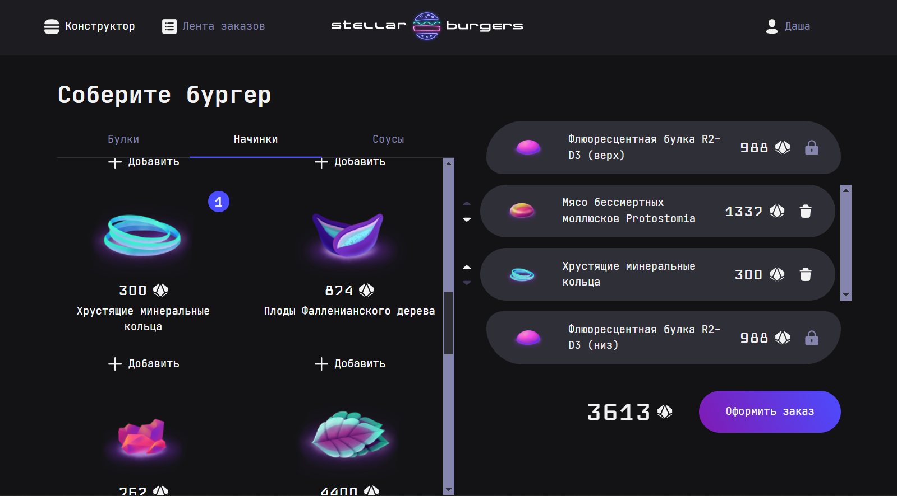

# Проект: Бургерная

Где-то на краю Вселенной любая форма жизни может заказать тот бургер, который она хочет… Конечно, с помощью приложения.

## Описание

SPA приложение космической бургерной с адаптивным дизайном. Для организации кода применена архитектурная методология FSD.
При создании компонентов использовалась UI-библиотека ([@zlden/react-developer-burger-ui-components](https://www.npmjs.com/package/@zlden/react-developer-burger-ui-components?activeTab=versions)).

## Live просмотр

## Технологический стек
- TypeScript
- React 18
- Redux Toolkit
- React Router DOM v6.10.0
- Webpack

## Что можно доработать...
Приложение находится в полностью рабочем состоянии, все необходимые функции реализованы, а пул-реквесты проверены и одобрены ревьюером. Тем не менее планирую добавить/изменить несколько вещей в ближайшее время.

- [] Валидация форм
- [] Сохранение корзины при перезагрузке страницы
- [] Очистка истории заказов
